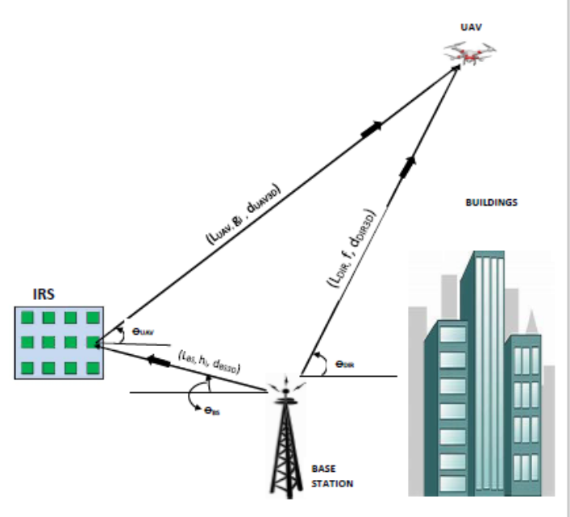
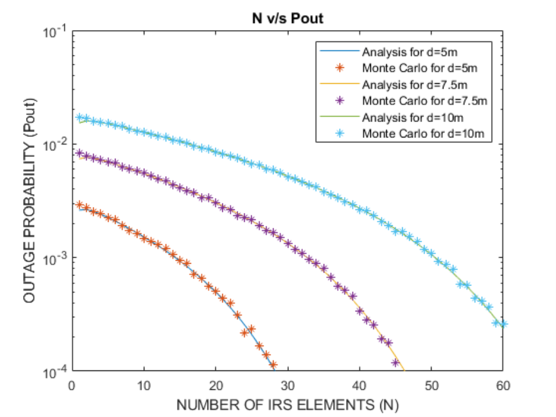
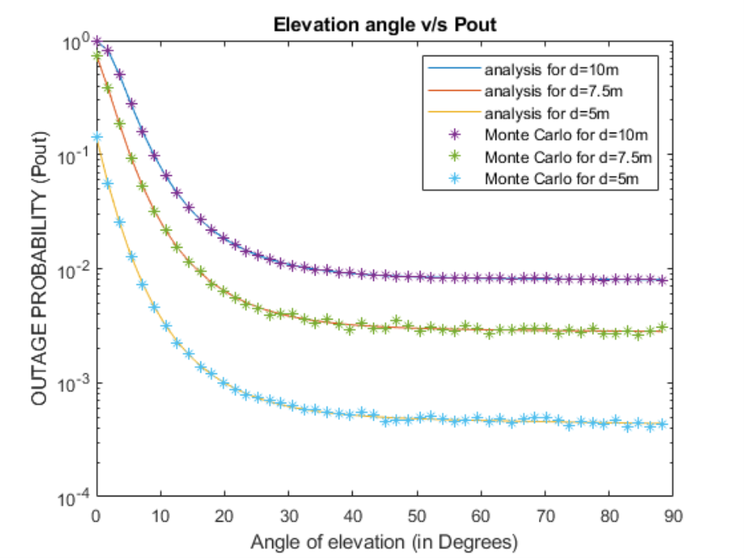

# Dynamic Charging of Unmanned Aerial Vehicles (UAVs) using Intelligent Reflecting Surfaces (IRS)

### M.Tech Thesis Project | Indian Institute of Technology (IIT), Guwahati

This repository contains the thesis, research poster, and simulation findings for my Master's project. The research investigates the feasibility of wirelessly charging UAVs using IRS to overcome range limitations and improve operational endurance.

---

## 🚀 Project Goal

The primary challenge with UAVs (drones) is their limited flight time due to battery constraints. This project models and analyzes a system where an **Intelligent Reflecting Surface (IRS)** is used to create a reliable, secondary line-of-sight path for wireless power transfer, especially in urban environments where direct line-of-sight is often blocked.

**The objective:** To determine the optimal system conditions (number of IRS elements, UAV elevation angle) that minimize power transfer outage probability.

---

## 🛠️ System Model & Key Concepts

The system consists of a Ground Base Station (BS), a UAV, and a planar IRS. The IRS intelligently reflects and focuses radio frequency (RF) signals from the BS toward the UAV, enabling it to harvest energy even in Non-Line-of-Sight (NLoS) conditions.

---

## 📈 Key Findings & Results

The analysis and simulations demonstrated a clear relationship between system parameters and performance.

1.  **More IRS Elements = Better Performance:** Increasing the number of reflecting elements on the IRS significantly decreases the outage probability, allowing for more reliable power transfer.

    

2.  **Higher Elevation Angle = Better Performance:** As the UAV's elevation angle increases, it moves into a more favorable Line-of-Sight (LoS) position, drastically improving energy transfer efficiency up to a certain point.

    

---

## 📂 Repository Contents

*   `OMKAR_JADHAV_MTech_Project.pdf`: The complete M.Tech thesis document.
*   `FINAL_POSTER.pdf`: A visual summary and poster of the project.

---

## ©️ Copyright & Licensing

**Thesis & Poster:** © 2022 Omkar Amol Jadhav. All Rights Reserved. The documents herein are for portfolio and reading purposes only. No part of these documents may be reproduced or distributed without prior written permission.

